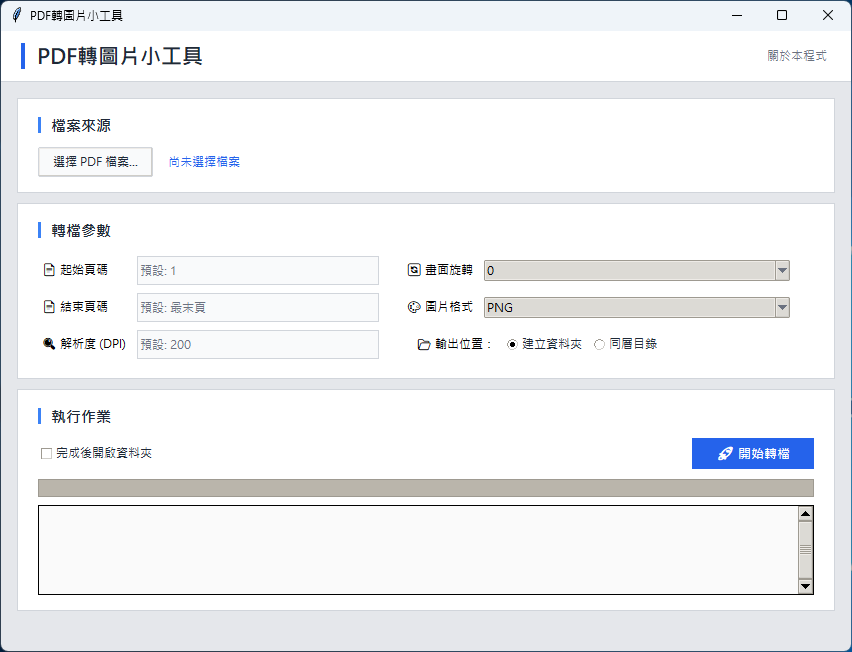

# PDF 轉圖片小工具


*(▲ 程式執行主畫面)*

這是一個供個人使用的輕量級圖形化小工具，最初只是因為個人工作需求，希望能有一個**在本機端快速執行、介面簡潔、且不需要上傳檔案到雲端**的 PDF 轉圖片工具，本程式能夠將 PDF 檔案快速轉換為圖片格式（PNG 或 JPG），程式介面簡潔，支援拖曳操作與批次轉檔。因為既有工具要嘛功能太複雜、要嘛需要收費或連網，所以決定請 ChatGPT 及 Gemini 用 Python 寫一個自己用，現在將它整理出來分享給有相同需求的人。

## ✨ 功能特色

* **操作簡單**：支援透過選擇或直接將檔案直接拖曳進視窗。
* **批次處理**：可一次轉換多個 PDF 檔案。
* **參數調整**：可自訂解析度、旋轉角度、輸出格式及頁碼範圍。
* **加密支援**：自動偵測加密的 PDF 檔案並跳出密碼輸入視窗。

## 🛠️ 環境需求與安裝

本程式使用 **Python 3.14** 開發，未在其他版本進行測試。在執行之前，請確保您已安裝 Python，並使用 pip 安裝以下必要的第三方套件。

### 1. 安裝套件

請開啟終端機 (Terminal) 或命令提示字元 (cmd)，執行以下指令：

```bash
pip install pypdfium2 Pillow tkinterdnd2
```

### 2. 第三方套件說明

本工具使用了以下開源套件來實現功能：

| 套件名稱 | 用途說明 |
| :--- | :--- |
| **pypdfium2** | **PDF 核心引擎**，負責讀取 PDF 檔案並將頁面渲染為圖片內容，速度快且不依賴外部環境。 |
| **Pillow** (PIL) | **圖片處理**，接收 PDF 引擎產生的數據，負責圖像的旋轉、格式轉換 (JPG/PNG) 與存檔。 |
| **tkinterdnd2** | **拖放功能支援**，讓 Python 內建的 Tkinter 介面能夠支援檔案拖曳 (Drag & Drop) 功能。 |

## 🚀 如何執行

安裝完前述套件後，請在終端機切換到程式所在的資料夾，並執行以下指令：

```bash
python pdf_image_converter.py
```
## 📦 打包成執行檔 (EXE)

如果您希望將此工具打包成單一 `.exe` 檔案以便在沒有 Python 的電腦上執行，燕翼使用 **PyInstaller**。

1.  **安裝 PyInstaller**：

    ```bash
    pip install pyinstaller
    ```

2.  **打包指令範例**：

    ```bash
    pyinstaller --noconsole --onefile --name "PDF轉圖片小工具" --collect-all tkinterdnd2 --collect-all pypdfium2 pdf_image_converter.py
    ```

打包完成後，執行檔將位於 `dist` 資料夾中。


## 一般使用者下載 (EXE)

如果您不想安裝 Python 環境，只想要簡單地直接使用軟體，目前我已經將打包成單一執行檔了。
請前往本專案的 **[Releases 頁面](https://github.com/kaoshou/pdf-image-converter/releases)** 下載後直接執行EXE檔即可，無需安裝任何軟體。

