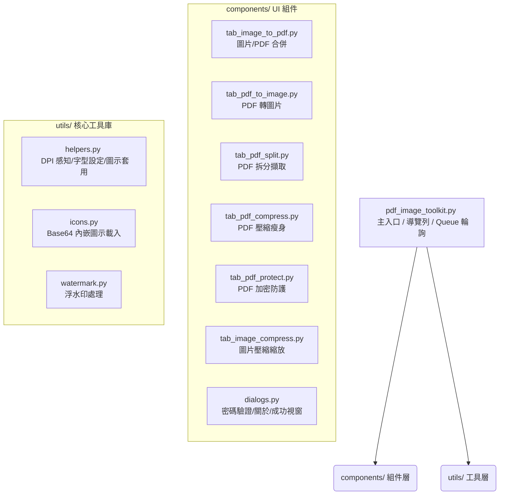

# 🛠️ PDF 圖片工具箱 (PDF-Image-Toolkit)

[](https://github.com/kaoshou/pdf-image-converter/blob/main/LICENSE)
[](https://www.python.org/)
[](https://github.com/kaoshou/pdf-image-converter)

一個基於 Python (CustomTkinter) 實作的**本地端完全離線 PDF 與圖片雙向處理工具箱**。完全離線運行、無廣告與後台連線，保護您的文件隱私安全。

---

## 📥 下載與安裝

### Windows 平台
本工具已上架至 **Microsoft Store**，Windows 使用者可直接點擊下方徽章前往下載並安裝。

<a href="https://apps.microsoft.com/store/detail/9PHJCKT834FL" target="_blank">
  
</a>

*(您亦可在 Windows 的 Microsoft Store 應用程式中直接搜尋「PDF圖片工具箱」進行安裝)*

### 其他平台與手動部署
本專案提供各平台（Windows, macOS, Linux）已建置完成的二進制版本，您也可以選擇使用原始碼自行編譯或執行：

* **下載已編譯版本**：請直接至 [GitHub Releases](https://github.com/kaoshou/pdf-image-converter/releases) 頁面下載適用於您系統的執行檔。
* **手動編譯或原始碼執行**：請參考下方的 [系統要求與環境安裝](#-系統要求與環境安裝) 進行手動部署。

---

## 📸 介面展示


---

## 💡 開發源由

在日常處理文件時，往往不需要開啟臃腫的專業軟體，只希望能快速完成轉檔或壓縮。雖然網路上有許多免費的線上轉檔工具，但將個人財務、合約等敏感文件上傳至雲端有極高的隱私外洩風險。

出於資安與隱私考量，本工具採**完全離線**運作。所有核心邏輯皆在您的本機電腦上執行，保證不傳輸任何資料到外部網路，讓您安心處理所有重要文件。

---

## 🏗️ 專案架構與模組設計

本專案採用模組化設計，介面（UI）與核心邏輯分離，整體架構如下：


```mermaid
graph TD
    A[pdf_image_toolkit.py <br/> 主入口 / 導覽列 / Queue 輪詢] --> B(components/ 組件層)
    A --> C(utils/ 工具層)

    subgraph components [components/ UI 組件]
        B1[tab_image_to_pdf.py <br/> 圖片/PDF 合併]
        B2[tab_pdf_to_image.py <br/> PDF 轉圖片]
        B3[tab_pdf_split.py <br/> PDF 拆分擷取]
        B4[tab_pdf_compress.py <br/> PDF 壓縮瘦身]
        B5[tab_pdf_protect.py <br/> PDF 加密防護]
        B6[tab_image_compress.py <br/> 圖片壓縮縮放]
        B7[dialogs.py <br/> 密碼驗證/關於/成功視窗]
    end

    subgraph utils [utils/ 核心工具庫]
        C1[helpers.py <br/> DPI 感知/字型設定/圖示套用]
        C2[icons.py <br/> Base64 內嵌圖示載入]
        C3[watermark.py <br/> 浮水印處理]
    end
```

### 📂 檔案目錄結構

```bash
pdf-image-toolkit/
├── pdf_image_toolkit.py      # 程式主入口，負責視窗管理、分頁切換與 Queue 異步分流
├── app_icon.png              # 原始高清圖示 (母檔)
├── app_icon.ico              # PyInstaller 編譯時所使用的 Windows 圖示
├── requirements.txt          # Python 相依套件清單
├── components/               # UI 各功能分頁與對話框組件
│   ├── tab_image_to_pdf.py   # 圖片/PDF ➔ PDF 合併分頁
│   ├── tab_pdf_to_image.py   # PDF ➔ 圖片導出分頁
│   ├── tab_pdf_split.py      # PDF 拆分與特定頁面擷取分頁
│   ├── tab_pdf_compress.py   # PDF 壓縮與黑白化分頁
│   ├── tab_pdf_protect.py    # PDF 加密與權限防護分頁
│   ├── tab_image_compress.py # 圖片品質、尺寸壓縮與旋轉分頁
│   └── dialogs.py            # 密碼輸入、關於本程式、成功提示等對話框
└── utils/                    # 底層邏輯與輔助函式
    ├── helpers.py            # 包含 DPI 縮放感知、系統字型選擇與主圖示尋找
    ├── icons.py              # 以 Base64 編碼內嵌的 UI 圖示集，免去外部圖片遺失風險
    └── watermark.py          # 浮水印載入與合成工具
```

---

## 🛠️ 六大核心功能特色

### 1. 圖片/PDF ➔ PDF 合併
* 支援將多張不同格式的圖片（JPG, PNG 等）與現有 PDF 檔案混合排序。
* **「展開 PDF」功能**：一鍵將多頁 PDF 拆解為單頁獨立加入清單，方便與其他圖片或 PDF 頁面交叉混編。
* 靈活的頁面控制：可自訂頁面尺寸（原始大小、A4、A3 等）、方向（橫式/直式）與縮放填充模式（留白填滿、拉伸、裁切）。

### 2. PDF ➔ 圖片
* 將 PDF 文件批次導出為常見圖片格式（PNG、JPEG、BMP、TIFF）。
* 支援自訂導出解析度（DPI），可自由在「小檔案」與「印刷級清晰度」之間調整。

### 3. PDF 拆分與擷取
* 可透過頁碼範圍表達式（例如：`1-3, 5, 8-12`）彈性篩選需要保留的頁面。
* 提供兩種拆分模式：
  * **單頁拆分**：每頁單獨拆分成一個獨立的 PDF 檔。
  * **範圍擷取**：將指定的頁面範圍抽取出來，合併成一個新的 PDF 檔。

### 4. PDF 壓縮與瘦身
* 專為掃描版或大體積 PDF 檔案設計，優化內部圖片解析度以達到瘦身效果。
* 支援**黑白化（灰階轉換）**，進一步降低文件體積。
* 底層採用多線程並行處理，大幅提升多頁文件壓縮速度。

### 5. PDF 加密防護
* 提供設定**開啟密碼（User Password）**與**權限密碼（Owner Password）**。
* 可細部設定安全性限制：禁止複製文字、禁止列印文件。
* 具備解鎖機制：若載入受密碼保護的 PDF，系統會自動彈出密碼輸入框完成解鎖驗證。

### 6. 圖片壓縮與縮放
* 支援批次轉換圖片格式（JPG, PNG, WEBP）與品質/體積壓縮。
* 可等比例縮放圖片長寬，並支援圖片方向旋轉。
* 提供**隱私保護**：可選擇自動移除圖片中的 EXIF 拍攝隱私資訊（如 GPS 定位、相機型號）。
* 內建**雙欄對比預覽框**：可即時對比原圖與預估壓縮後的畫質和體積。

---

## 💻 系統要求與環境安裝

本專案支援 Windows 與 macOS 系統。

### 1. 複製專案
```bash
git clone https://github.com/kaoshou/pdf-image-converter.git
cd pdf-image-converter
```

### 2. 安裝依賴套件
推薦在虛擬環境（venv）中運行：

```bash
# 建立虛擬環境
python -m venv venv

# 啟用虛擬環境 (Windows PowerShell)
.\venv\Scripts\Activate.ps1

# 啟用虛擬環境 (macOS/Linux)
source venv/bin/activate

# 安裝相依套件
pip install -r requirements.txt
```

> [!NOTE]
> 本程式依賴 `customtkinter` (現代化 UI 庫)、`pymupdf` (PDF 核心處理)、`pillow` (圖片處理與縮放) 以及 `tkinterdnd2` (檔案拖放支援)。

### 3. 啟動應用程式
```bash
python pdf_image_toolkit.py
```

---

## 📦 如何打包成單一免安裝執行檔 (.exe)

如果您想將其打包成可以直接在 Windows 上運行的單一免安裝 `.exe` 綠色軟體，請遵循以下步驟：

1. 安裝 PyInstaller：
   ```bash
   pip install pyinstaller
   ```
2. 執行打包指令（打包時直接指定根目錄的 `app_icon.ico` 作為應用程式圖示）：
   ```bash
   pyinstaller --noconfirm --onedir --windowed --name "PDF圖片工具箱" --icon "app_icon.ico" --add-data "components;components" --add-data "utils;utils" pdf_image_toolkit.py
   ```
3. 打包完成後，您可在 `dist/PDF圖片工具箱/` 資料夾內找到可執行的 `PDF圖片工具箱.exe`。

---

## 📜 第三方套件與開源授權聲明

本專案採用 **GNU Affero General Public License v3.0 (AGPL v3.0)** 授權協議釋出，以符合與專案中所深度使用之 PyMuPDF 授權條款的相容性。詳細授權條款請參閱 [LICENSE](LICENSE) 檔案。

本專案基於以下優秀開源專案實作：
* [PyMuPDF (fitz)](https://github.com/pymupdf/PyMuPDF) - GNU AGPL v3.0 授權
* [CustomTkinter](https://github.com/TomSchimansky/CustomTkinter) - MIT 授權
* [TkinterDnD2](https://github.com/pmgagne/tkinterdnd2) - MIT 授權

* 感謝生成式AI工具的幫助下完成開發