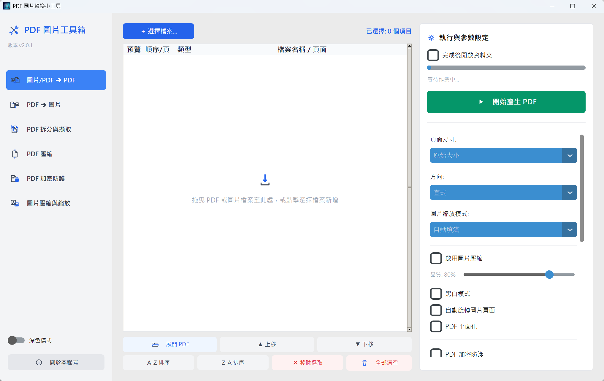

# PDF 圖片工具箱 (pdf-image-toolkit)

[](https://github.com/kaoshou/pdf-image-converter/blob/main/LICENSE)
[](https://www.python.org/)
[](https://github.com/kaoshou/pdf-image-converter)

一個基於 Python 和 CustomTkinter 實作的本地端 **PDF 與圖片雙向轉換工具箱**。完全離線運行，無廣告，保護您的文件隱私安全。

---

## 💡 開發初衷

本工具是我當初為了解決「本地端文件轉檔需求」而開發的。
在日常處理文件時，往往不想要開啟龐大、臃腫的專業軟體，只希望能快速完成轉換。
同時，雖然網路有許多免費的線上轉檔工具，但上傳敏感的文件有隱私外洩的風險。出於資安考量，我(AI)寫了這款完全離線運作的小工具，現在分享給大家使用。

---

## 📸 介面展示



---

## 🛠️ 主要功能

1. **圖片/PDF ➔ PDF 合併**
   - 支援將多張圖片與 PDF 混合併批次合併。
   - 提供 **「展開 PDF」** 功能，一鍵將多頁 PDF 拆解為單頁獨立加入清單中混編。
   - 支援設定頁面尺寸（原始大小、A4、A3 等）、方向（橫式/直式）與縮放填充模式。
   - 整合黑白化、自動旋轉糾正與 PDF 加密保護。

2. **PDF ➔ 圖片**
   - 將 PDF 文件批次導出為常見圖片格式 (PNG, JPEG, BMP, TIFF)。
   - 可自訂導出解析度 (DPI) 以控制圖片清晰度。

3. **PDF 拆分與擷取**
   - 可指定頁碼範圍進行拆分（例如 `1-3, 5, 8-12`）。
   - 提供「每頁單獨拆分成一個檔」或「擷取指定頁面合併」兩種模式。

4. **PDF 壓縮**
   - 針對掃描版或大體積 PDF 進行解析度優化與瘦身。
   - 支援黑白化以進一步降低文件體積，並使用多線程並行處理。

5. **PDF 加密防護**
   - 可設定開啟密碼與限制複製/列印等權限。
   - 對於受密碼保護的 PDF，在載入時會自動彈出解鎖驗證框。

6. **圖片壓縮與縮放**
   - 支援圖片格式轉換 (JPG, PNG, WEBP) 與尺寸/品質壓縮。
   - 支援圖片方向旋轉、移除 EXIF 拍攝隱私資訊。
   - 提供雙欄預覽對話框，可即時對比原圖與預估壓縮後的畫質和體積。

---

## 💻 系統要求與安裝說明

### 1. 複製專案
```bash
git clone https://github.com/kaoshou/pdf-image-converter.git
cd pdf-image-converter
```

### 2. 安裝依賴套件
推薦在虛擬環境中運行：
```bash
python -m venv venv
# 啟用虛擬環境
# Windows (PowerShell):
.\venv\Scripts\Activate.ps1
# macOS/Linux:
source venv/bin/activate

# 安裝依賴套件
pip install -r requirements.txt
```

> **Note**: 本程式依賴 `customtkinter` (UI 庫)、`pymupdf` (PDF 處理)、`pillow` (圖片處理) 以及 `tkinterdnd2` (拖放載入支援)。

### 3. 啟動應用程式
```bash
python pdf_image_toolkit.py
```

---

## 📦 如何打包成單一免安裝執行檔 (.exe)

如果您想將其打包成可以直接在 Windows 上運行的單一免安裝 `.exe` 綠色軟體，請遵循以下步驟：

1. 安裝 PyInstaller：
   ```bash
   pip install pyinstaller
   ```
2. 執行打包指令（圖示已由 Pillow 動態繪製，打包時直接指定根目錄的 `app_icon.ico` 即可）：
   ```bash
   pyinstaller --noconfirm --onedir --windowed --name "PDF圖片工具箱" --icon "app_icon.ico" --add-data "components;components" --add-data "utils;utils" pdf_image_toolkit.py
   ```
3. 打包完成後，可在 `dist/PDF圖片工具箱` 資料夾內找到可執行檔。

---

## 📜 第三方套件與開源授權聲明

本專案採用 **GNU Affero General Public License v3.0 (AGPL v3.0)** 授權協議釋出，以符合與專案中所深度使用之 PyMuPDF 授權條款的相容性。詳細授權條款請參閱 [LICENSE](LICENSE) 檔案。

本專案基於以下優秀開源專案實作：

* [PyMuPDF (fitz)](https://github.com/pymupdf/PyMuPDF) - GNU AGPL v3.0 授權
* [CustomTkinter](https://github.com/TomSchimansky/CustomTkinter) - MIT 授權
* [TkinterDnD2](https://github.com/pmgagne/tkinterdnd2) - MIT 授權
